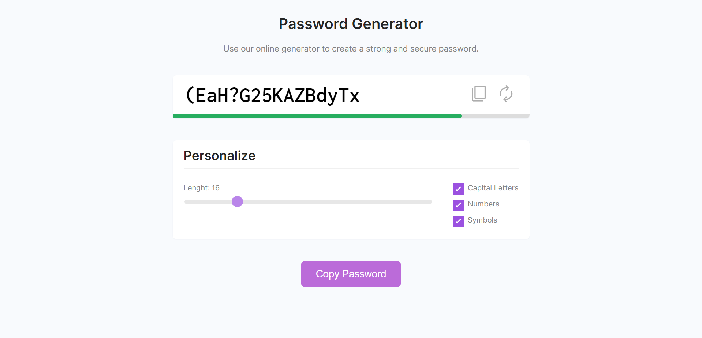
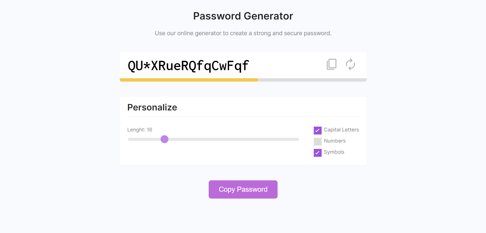
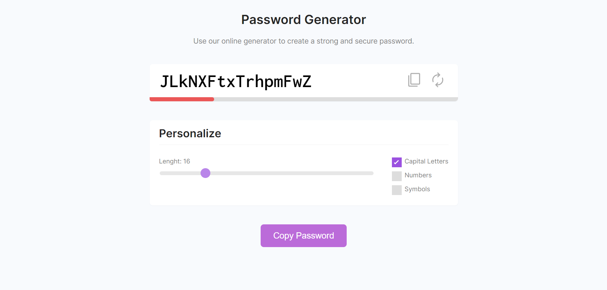

<h1 align="center"> Password Generator </h1>

  

  

  

  

## 💻 Projeto

O DevLinks é um agregador de links para usar como cartão de visitas online.

- [Acesse o projeto finalizado, online](https://luisfv10.github.io/Password-Generator)

## 🚀 Tecnologias

Esse projeto foi desenvolvido com as seguintes tecnologias:

- HTML
- CSS
- Javascript
- Git e Github

## 📝 Licença

Esse projeto está sob a licença MIT.
